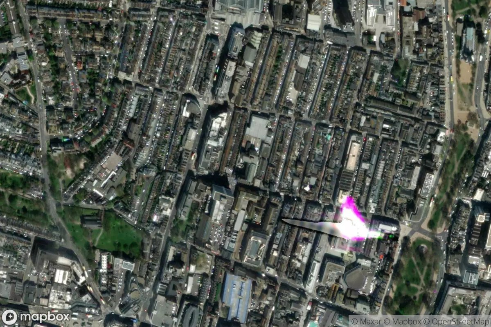

brighton twitter bot
===
# introduction
this project builds the brighton mapbot, a twitter bot (`@brighton_mapbot`) which uses _github actions_ to post a tweet every hour with:

- a randomly selected postcode within bn1/bn2/bn3 (brighton and hove, uk).
- a satellite image (sourced from [mapbox.com](https://mapbox.com)) of that spot.
- a link to [open street map](https://openstreetmap.org) of the same area.
- altitude over sea level assigned to that postcode. 

please note that very little of this code is mine. this project is a copy the work of the very clever [matt dray](https://twitter.com/mattdray) from [here](https://github.com/matt-dray/londonmapbot), and [described here](https://www.rostrum.blog/2020/09/21/londonmapbot/). the talented matt presented his bot (`@londonmapbot`) with flair to the londonR meeting in february 2022 (see [here](https://www.ascent.io/london-r-february-gathering-welcometoascent-followup) for a recording well worth your time).

the minor differences between this effort and matt's include:

- matt could get away with setting a rectangular bounding box (with the latitude limits independent of the longitude limits and vice versa) delimiting central london. that doesn't work well for brighton, as many of the chosen points would land in the ocean. instead, `@londonmapbot`'s "relative in brighton" reads in a data file, downloaded from [doogal](https://www.doogal.co.uk/UKPostcodes.php), containing a list of all the postcodes within brighton and hove, along with their gps coordinates (latitude, longitude in fractional degrees), and altitude. the bot randomly selects one of these postcodes, and sends the corresponding coordinates to mapbox to get the satellite image. 

- i broke up the code into little function and spread them out into little files in the `src/` folder. the `bot.R` script does very little other than calling those functions.

# instructions - concise
- clone this repository to your system.
- sign up for a twitter account [here](twitter.com) with developer access and _elevated api access_.
    + create a twitter app.
    + generate api access key, access key secret, and bearer token for this account and store as environment variables
- sign up for an account with [mapbox.com](https://mapbox.com/), if not already established.
    + generate an api key and save in an environment variable
- fetch a postcode data file of interest from [doogal](https://www.doogal.co.uk/UKPostcodes.php. and save in the `data/`
- install required packages: `rtweet` `tidyverse`.
- test run the `bot.R` file on the project root.
- when satisfied it runs as expected, set up a _github action_ with your environment variables as _secrets_ and edit `.github/workflows/bot.yml` as required.
- add, commit, and push your version of the mapbot to your account on github.com.

# instructions - verbose
## set up the project
- clone the repo to your system
- fetch a postcode data file of interest from [doogal](https://www.doogal.co.uk/UKPostcodes.php) and save in the `data/` folder (or update the `path_to_data_folder` variable in `bot.R`)

## set up access to twitter's api
twitter is more often accessed from python than it is from `R`, and consequently there are a lot more examples and tutorials available for python than there are for `R`. nevertheless, a number of `R` packages support accessing twitter's api. i am aware of:

- `rtweet`
- `twitteR`
- `streamR`
- `RTwitterAPI`

at a glance these seem mostly intended to fetch posts and other data from twitter (for doing analysis on that data). most of the tutorials and documentation focus on that use case. only the first two packages support posting content to twitter (tweetign), which is what our bot application is meant to do. 

following matt's lead, i use first of those two packages, `rtweet`, even though it has not been kept up to date with twitter's latest api changes. the documentation for that package recommends using twitter's oauth v1.0 support (and not v2.0).

alas, the [instructions](https://docs.ropensci.org/rtweet/reference/rtweet_user.html) on how to set up the access key are defunct (dead link to [here](https://rtweet.info/articles/auth.html)). you can instead follow instructions from [here](https://theusualstuff.com/generate-twitter-consumer-key-access-token/), or try to follow twitter's own documentation.

1. set up a [developer twitter account](https://developer.twitter.com)
2. go to the [developer portal](https://developer.twitter.com/en/portal/dashboard)
3. create a [project](https://developer.twitter.com/en/docs/projects/overview), and within it, an [app](https://developer.twitter.com/en/docs/apps/overview).
4. apply for an _elevated developer access_.
5. you will need to generate api keys and make note of them in your environment. generate the following twitter api keys and corresponding api key secrets:
    + `TWITTER_API_KEY`
    + `TWITTER_API_KEY_SECRET`
    + `TWITTER_MAPBOT_ACCESS_TOKEN`
    + `TWITTER_MAPBOT_ACCESS_TOKEN_SECRET`
6. you can also generate a `TWITTER_BEARER_TOKEN`, which works well for api v2.0 but i was only able to get that to work for reading tweets, not for posting tweets. your milage may vary. 

## setup mapbox access
this step is much easier. set up an account following [instructions here] (https://docs.mapbox.com/help/getting-started/access-tokens/#how-access-tokens-work)
    + make note of your `MAPBOX_PUBLIC_ACCESS_TOKEN` it should be saved it in an environment variable of the environment you run the code on.

## set up github actions:
in your github repository, go to 'settings' . find 'secrets' on the left hand side, choose 'actions' from the sub menu. click "new repository secret" and enter `TWITTER_API_KEY` in the name field and your api key in the value field. repeat for:
    + `TWITTER_API_KEY_SECRET`
    + `TWITTER_MAPBOT_ACCESS_TOKEN`
    + `TWITTER_MAPBOT_ACCESS_TOKEN_SECRET`
    + `MAPBOX_PUBLIC_ACCESS_TOKEN`

# next steps
the bot can be extended in many various directions. one intrguing way would be to add an image analysis step, and report on some statistic of the satellite image, e.g. percent of greenspaces in the frame. alternatively, one could just 
continue along the path of copying everything that matt does:

- https://www.rostrum.blog/2020/12/20/londonmapbot-leaflet/
- https://www.rostrum.blog/2021/07/23/london-colour/
